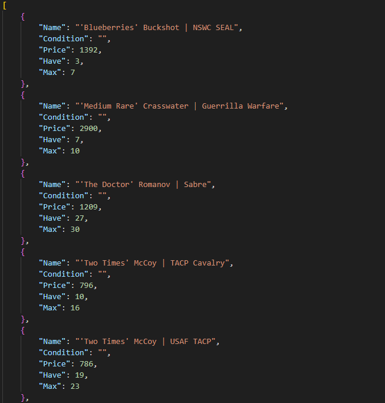
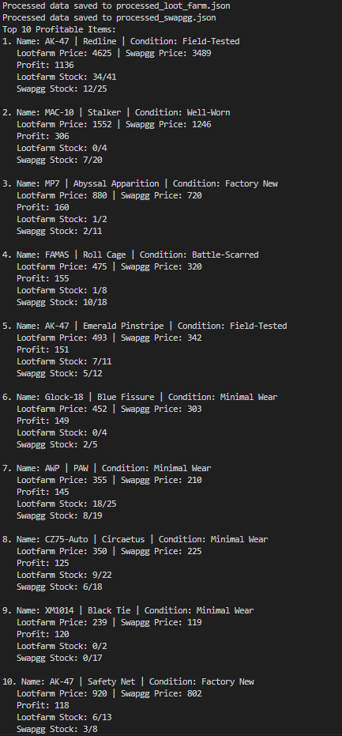

# Virtual-Item-Trading Comparison Tool

This Python script fetches data from Virtual Item Trading Websites, processes the information, and identifies the top 10 most profitable items for trading.

## Features

- Fetches data from Lootfarm and Swapgg
- Processes and saves data to JSON files
- Compares prices to identify profitable items
- Displays top 10 most profitable items

## Setup

1. Install the required libraries:

   ```
   pip install requests
   ```

2. Create a file named `Token.py` in the same directory as the main script. This file should contain the following variables:

   ```
   swap_url = "URL"
   loot_url
   headers = {
       "Request": "Headers"
   }
   ```

   > Replace api urls and `headers` with the actual API URLs and request headers.

## Usage

Run the script using Python:

```
python app.py
```

The script will:
1. Fetch data from Lootfarm and Swapgg
2. Process and save the data to JSON files
3. Compare the prices and identify profitable items
4. Display the top 10 most profitable items

## Output

The script will create two JSON files:
- `processed_loot_farm.json`: Processed data from Lootfarm
- `processed_swapgg.json`: Processed data from Swapgg
  


It will then display the top 10 profitable items in the console, showing:
- Item name and condition
- Prices on both platforms
- Potential profit
- Stock information
  


## Note

> Ensure you have the necessary API access and permissions for both Lootfarm and Swapgg before running the script. 

